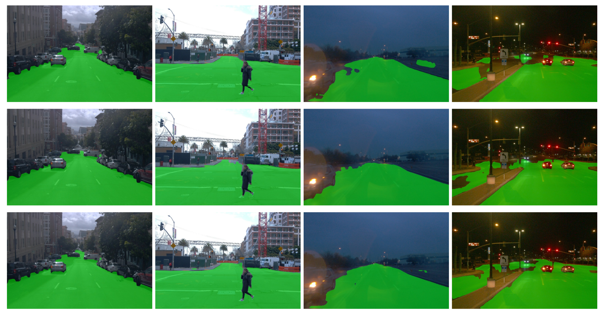

# Lidar Annotation Is All You Need


## Results

### Visualization of results



Comparison of predictions of three models on the Waymo Open Dataset. From top to bottom: 2D only, projected 3D only, mix 2D + projected 3D

### Metrics


Road segmentation results (% of IoU) on the validation split of the "Waymo full" dataset for models trained on different ratios of 2D image masks and lidar-based ground truth

## Setup

### Dataset preparation

You can download filtered Waymo dataset (Waymo with intersection in the paper) from [the link](https://drive.google.com/file/d/1TAtAqf6xSmsp_IMqfKHTg4kchacuPXuk/view?usp=sharing).

Or filter dataset using our script:

Download training and validation folders of [waymo-open-dataset](https://github.com/waymo-research/waymo-open-dataset) (we used [1.4.0 version](https://console.cloud.google.com/storage/browser/waymo_open_dataset_v_1_4_0/individual_files?pageState=(%22StorageObjectListTable%22:(%22f%22:%22%255B%255D%22))&prefix=&forceOnObjectsSortingFiltering=false)). 2d segmentation ground truth and point cloud segmentation ground truth are made separately and not for all images. For the paper, we created a dataset from all images, for which annotations are intersected. To filter and save the dataset use these commands:

```shell
pip install -r lib/waymo_process/requirments.txt
python3 lib/waymo_process/create_2d3d_dataset.py {path_to_training_or_validation_folder_of_waymo_dataset} --subset={'val' or 'train'}
```

- --subset - folder name to save data
- --lidar_data_only=True - for saving only reprojected point cloud points for both road (gt) and other classes (loss mask)
- --masks_only=True - for saving only 2d masks.
- If no flag is chosen from lidar_data_only and masks_only, you will get dataset of images where 2d segmentation ground truth and point cloud segmentation ground truth are intersected.

_Note: val subset needs both lidar data and 2d masks, don't override flags --lidar_data_only and --masks_only when generating val subset_

You should get 1852 images in train set and 315 images in val set with both 2d masks of road and reprojected points for road and other classes.

### Docker

Build a contatiner:

```shell
DOCKER_BUILDKIT=1 docker build --network host -t lidar_segm --target base_image --build-arg UID=1000 --build-arg GID=1000 --build-arg USERNAME={your username} .
```

Run the container:

```shell
docker run --net=host --userns=host --pid=host -itd --gpus all --name=lidar_segm --volume={path_to_lidar_data_2d_road_segmentation}:/lidar_data_2d_road_segmentation --volume={path_to_dataset}:/data/ --shm-size 15G --cpuset-cpus 0-7 lidar_segm
```

Attach to the container:

```shell
docker exec -it lidar_segm bash
```

Stop and remove the container:

```shell
docker container stop lidar_segm
docker container rm lidar_segm
```

### Conda

Alternatively you can use conda on ubuntu 20.04 with python 3.8.

```shell
conda env create -f environment.yml
```

## Training

Specify path to the dataset (DATASET.PATH) and other training params in lib/config/waymo.py and then run the script:

```shell
python3 scripts/train.py
```

By setting DATASET.MASKS_ONLY = True in config file, you will run model training using only 2d ground truth masks. DATASET.LIDAR_DATA_ONLY = True will lead to the training only using projected from the point cloud road ground truth. If both parameters are set to False (default), the model will train on mix of these two types of the ground truth. In all cases, the validation dataset requires 2d ground truth masks for metrics calculation.

## Testing

You can download model weights (mixing experiment, Waymo full in the paper) from [the link](https://drive.google.com/file/d/1c-LnNKLsb8Gpdu-vww4K3DCn8ymqQwHl/view?usp=sharing). Then Specify path to the dataset (DATASET.PATH) and other inference params in lib/config/waymo_inference.py and then run the script:

```shell
python scripts/test.py --weights {path to the .pth weights} --save_video
```

## Acknowledgements

* [YOLOP](https://github.com/hustvl/YOLOP)
* [segmentation_models.pytorch](https://github.com/qubvel/segmentation_models.pytorch)
* [Waymo Open Dataset](https://github.com/waymo-research/waymo-open-dataset)

## Internal info (to delete later)

[Overleaf link](https://www.overleaf.com/1696216323nwdndpcgrhwx)

[Paper concept and list of tasks with deadlines](https://evocargo.atlassian.net/wiki/spaces/PER/pages/717815826/-+Lidar+data+is+all+you+need+for+2d+road+segmentation)

### TODO:

* gdrive link to the dataset
* lib/core/loss refactoring: MaskedLoss class
* simplify and delete redundant:
  * lib/config
  * lib/utils
* add pre-commit
* save weights + folder with test images + make folder inference example
