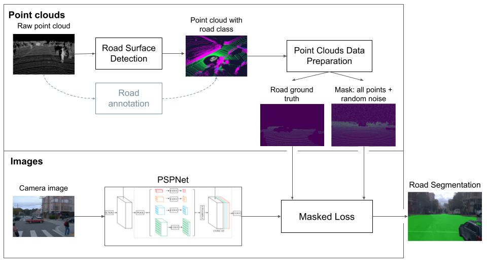
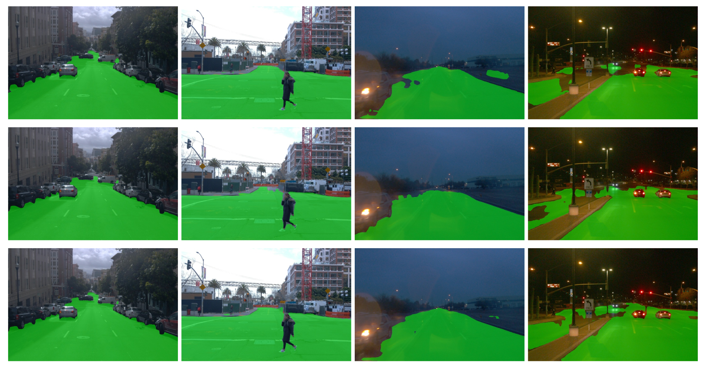
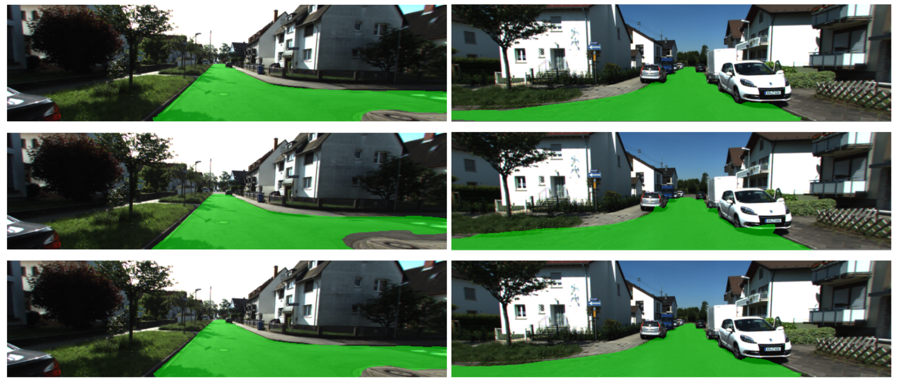
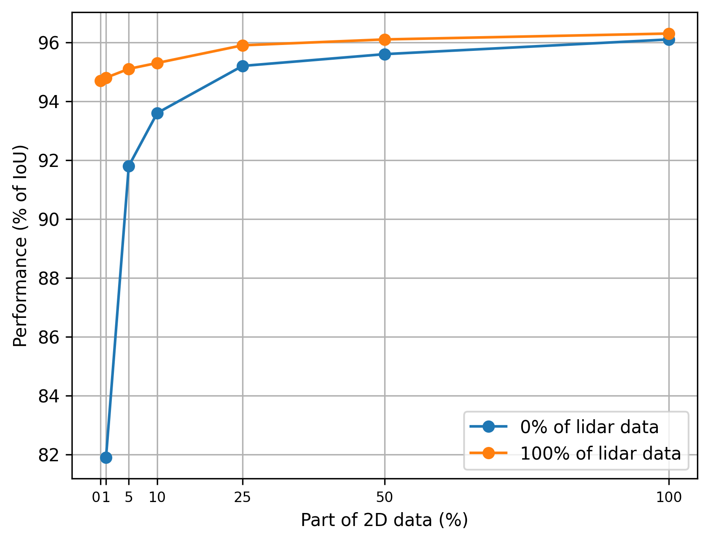

# Lidar Annotation Is All You Need



We propose a novel approach that effectively leverages lidar annotations to train image segmentation models directly on RGB images. The approach consists of four main parts: point cloud road annotation, data preparation, masked loss, and the segmentation model itself. The key innovation
of our approach is the masked loss, addressing sparse ground-truth masks from lidar point clouds. By
calculating loss exclusively where lidar points exist, the model learns road segmentation on images by
using lidar points as ground truth. The flexibility of the approach allows mixing lidar data with 2D ground truth, and by doing that, increasing the quality of predictions.

You can find a detailed description of our approach in the [paper](https://arxiv.org/abs/2311.04777). If you find our work useful for your research, please consider giving it a star
⭐ and citing the paper:

```
@misc{sharafutdinov2023lidar,
      title={Lidar Annotation Is All You Need},
      author={Dinar Sharafutdinov and Stanislav Kuskov and Saian Protasov and Alexey Voropaev},
      year={2023},
      eprint={2311.04777},
      archivePrefix={arXiv},
      primaryClass={cs.CV}
}
```

## Results




_Comparison of predictions of three models on the Waymo Open and KITTI-360
datasets. From top to bottom: 2D only, projected 3D only, mix 2D + projected 3D_

### Metrics



_Road segmentation results (% of IoU) on the validation split of the "Waymo
full" dataset for models trained on different ratios of 2D image masks and
lidar-based ground truth_

## Setup

### Dataset preparation


_Lidar-based road ground truth for three setups placed from top to bottom: Waymo
Open Dataset (five proprietary lidar sensors), KITTI-360 (Velodyne HDL-64E
lidar), Proprietary dataset (two Robosense RS-Helios lidars)._

#### Waymo
You can download the filtered Waymo dataset (Waymo with intersection in the
paper) from
[the link](https://drive.google.com/file/d/1TAtAqf6xSmsp_IMqfKHTg4kchacuPXuk/view?usp=sharing).

Or filter the full dataset using our script:

Download the training and validation folders of
[waymo-open-dataset](https://github.com/waymo-research/waymo-open-dataset) (we
used the
[1.4.0 version](https://console.cloud.google.com/storage/browser/waymo_open_dataset_v_1_4_0/individual_files?pageState=(%22StorageObjectListTable%22:(%22f%22:%22%255B%255D%22))&prefix=&forceOnObjectsSortingFiltering=false)).
2D segmentation ground truth and point cloud segmentation ground truth are made
separately and not for all images. We created two datasets for the paper: "Waymo with intersection" and "Waymo full". The first one is a dataset created from all original images, for which 2D and lidar annotations are intersected. The second one is created separately for 2D and lidar annotations and then combined together. To filter and save the dataset, use these commands:

```shell
pip install -r lib/waymo_process/requirments.txt
python3 lib/waymo_process/create_2d3d_dataset.py {path_to_training_or_validation_folder_of_waymo_dataset} --subset={'val' or 'train'}
```

- --subset - folder name to save data
- --lidar_data_only=True - for saving only reprojected point cloud points for
  both road (gt) and other classes (loss mask)
- --masks_only=True - for saving only 2D masks.
- If no flag is chosen from lidar_data_only and masks_only, you will get a
  dataset of images where 2D segmentation ground truth and point cloud
  segmentation ground truth are intersected.

_Note: val subset needs both lidar data and 2D masks, don't override flags
--lidar_data_only and --masks_only when generating val subset_

For "Waymo with intersection" you should get 1852 images in the train set and 315 images in the val set with both 2D masks of road and reprojected points for road and other classes.

#### KITTI-360
We cannot provide filtered KITTI-360 dataset for this task due to its size. But you can get it easily by yourself.

Firstly download original KITTI-360 dataset from here:

https://www.cvlibs.net/datasets/kitti-360/

To process KITTI-360 to our data format you have to use following repositories:
1) https://github.com/autonomousvision/kitti360Scripts - official KITTI-360 repo for working with the dataset
2) https://github.com/JulesSanchez/recoverKITTI360label - unofficial KITTI-360 to recover lidar labels from 

Using this 2 tools you can get all needed labels and images.

### Docker

Build a contatiner:

```shell
DOCKER_BUILDKIT=1 docker build --network host -t lidar_segm --target base_image --build-arg UID=1000 --build-arg GID=1000 --build-arg USERNAME={your username} .
```

Run the container:

```shell
docker run --net=host --userns=host --pid=host -itd --gpus all --name=lidar_segm --volume={path_to_lidar_data_2d_road_segmentation}:/lidar_data_2d_road_segmentation --volume={path_to_dataset}:/data/ --shm-size 15G --cpuset-cpus 0-7 lidar_segm
```

Attach to the container:

```shell
docker exec -it lidar_segm bash
```

Stop and remove the container:

```shell
docker container stop lidar_segm
docker container rm lidar_segm
```

### Conda

Alternatively, you can use conda on Ubuntu 20.04 with Python 3.8.

```shell
conda env create -f environment.yml
```

## Training

Specify the path to the dataset (DATASET.PATH) and other training parameters in
lib/config/waymo.py and then run the script:

```shell
python3 scripts/train.py
```

By setting DATASET.MASKS_ONLY = True in the config file, you will run model
training using only 2D ground truth masks. DATASET.LIDAR_DATA_ONLY = True will
lead to the training only using projected from the point cloud road ground
truth. If both parameters are set to False (default), the model will train on a
mix of these two types of ground truth. In all cases, the validation dataset
requires 2D ground truth masks for metric calculation.

## Testing

To test the model specify the path to the dataset (DATASET.PATH) and other
inference parameters in lib/config/waymo_inference.py and then run the script:

```shell
python scripts/test.py --weights {path to the .pth weights} --save_video
```

Unfortunately, publishing the weights of a model trained with the use of the
Waymo open dataset is prohibited by the dataset license. But the training
experiments can be easily reproduced using our repository and the data provided.

## License

Project is distributed under the
[MIT License](https://github.com/Evocargo/Lidar-Annotation-is-All-You-Need/blob/main/LICENSE)

## Acknowledgements

- [YOLOP](https://github.com/hustvl/YOLOP)
- [segmentation_models.pytorch](https://github.com/qubvel/segmentation_models.pytorch)
- [Waymo Open Dataset](https://github.com/waymo-research/waymo-open-dataset)
