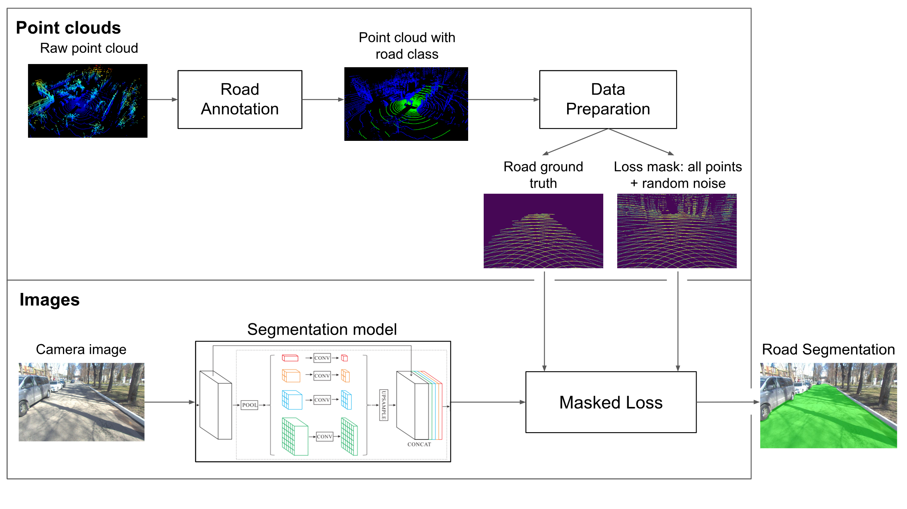

# Lidar Annotation Is All You Need

## Results

### Metrics
TODO: table from the paper

### Visualization of results
TODO: images from the paper + nice video

## Setup
### Dataset preparation
Download [waymo-open-dataset](https://github.com/waymo-research/waymo-open-dataset). Then filter it using provided script: 
```shell
pip install -r requirements.txt
TODO
```

### Docker
Build contatiner:
```shell
DOCKER_BUILDKIT=1 docker build --network host -t lidar_segm --target base_image --build-arg UID=1000 --build-arg GID=1000 --build-arg USERNAME={your username} .
```

Run container:
```shell
docker run --net=host --userns=host --pid=host -itd --gpus all --name=lidar_segm --volume={path_to_lidar_data_2d_road_segmentation}:/lidar_data_2d_road_segmentation --volume={path_to_dataset}:/data/ --shm-size 15G --cpuset-cpus 0-7 lidar_segm
```

Attach to container:
```shell
docker exec -it lidar_segm bash
```

### Conda
```shell
conda env create -f environment.yml
```

## Training
```shell
cd /lidar_data_2d_road_segmentation
python3 scripts/train.py
```

## Testing
```shell
python scripts/test.py --weights {path to the .pth weights} --save_video
```

## Acknowledgements
* [YOLOP](https://github.com/hustvl/YOLOP)
* [segmentation_models.pytorch](https://github.com/qubvel/segmentation_models.pytorch)
* [Waymo Open Dataset](https://github.com/waymo-research/waymo-open-dataset)


## Internal info (to delete later)
[Overleaf link](https://www.overleaf.com/1696216323nwdndpcgrhwx) 

[Paper concept and list of tasks with deadlines](https://evocargo.atlassian.net/wiki/spaces/PER/pages/717815826/-+Lidar+data+is+all+you+need+for+2d+road+segmentation)

### TODO:
* add script for waymo dataset processing
* simplify and delete redundant:
    * config
    * loss
    * utils
* add pre-commit

### Extra:
* move to albumentations 
* move to external metrics 